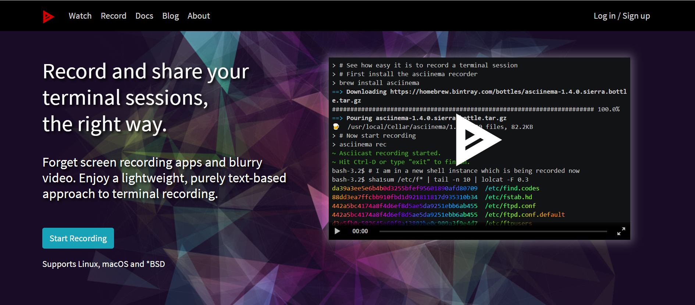
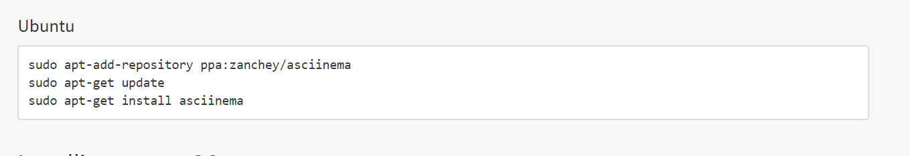

# 第二次作业

### 软件环境

Ubuntu 18.04 Server 64bit

### 实验问题

在asciinema注册一个账号，并在本地安装配置好asciinema

确保本地已经完成asciinema auth，并在asciinema成功关联了本地账号和在线账号

上传本人亲自动手完成的vimtutor操作全程录像

在自己的github仓库上新建markdown格式纯文本文件附上asciinema的分享URL

# 注册asciinema账号

### 官网地址

https://asciinema.org/

# 安装asciinema

https://asciinema.org/docs/installation 内有关于ubuntu环境下的安装说明

这里遇到的问题是打开putty显示连接超时，原因是在重新打开虚拟机时host-only网卡并未启动

安装成功结果如下图：

### 关联asciinema账号

asciinema auth  得到的网址即为注册网址，因为之前已经已注册成功，已关联

# vimtutor操作全程录像

[lesson1](https://asciinema.org/a/TyU4grv05s5VRyiDhhZvq7I9W)

[lesson2](https://asciinema.org/a/YdgITrkSY8xWposPe9XuT0oCJ)

[lesson3](https://asciinema.org/a/Lh4DV4YmMEqrumiyu5zKHJRIZ)

[lesson4](https://asciinema.org/a/BG8DGkr8iivOZXIlynlPCsZrZ)

[lesson5](https://asciinema.org/a/MmCteO5PtG5quyWvts4cqWD5F)

[lesson6](https://asciinema.org/a/Egnf0H5jImzMLYkxPf7VqhPZ5)

[lesson7](https://asciinema.org/a/MowEvWvATzu6c2RElpwqqDfy1)

# VIMTUTOR完成后的自查清单

- 你了解vim有哪几种工作模式？

命令模式，使用 Vim 编辑文件时，默认处于命令模式。此模式下，可使用方向键（上、下、左、右键）或 k、j、h、i 移动光标的位置，还可以对文件内容进行复制、粘贴、替换、删除等操作

输入模式，使 Vim 进行输入模式的方式是在命令模式状态下输入 i、I、a、A、o、O 等插入命令

编辑模式，使 Vim 切换到编辑模式的方法是在命令模式状态下按“：”键，此时 Vim 窗口的左下方出现一个“：”符号，这是就可以输入相关指令进行操作了

- Normal模式下，从当前行开始，一次向下移动光标10行的操作方法？如何快速移动到文件开始行和结束行？如何快速跳转到文件中的第N行？

向下移动光标10行：10j

快速移动到文件开始行 ： gg

快速移动到文件结束行：G

快速跳转到第N行：Ngg或者NG

- Normal模式下，如何删除单个字符、单个单词、从当前光标位置一直删除到行尾、单行、当前行开始向下数N行？

删除单个字符：x

删除单个单词：光标在单词头，dw或者de

从当前删到行尾：d$

删除单行：dd

删除N行；Ndd

- 如何在vim中快速插入N个空行？如何在vim中快速输入80个-？

快速插入N个空行：[N]o 

快速输入80个-：[80]i- 

- 如何撤销最近一次编辑操作？如何重做最近一次被撤销的操作？

撤销最近一次操作 ： u

重做最近一次被撤销的操作 ： ctrl+r

- vim中如何实现剪切粘贴单个字符？单个单词？单行？如何实现相似的复制粘贴操作呢？

vim中，最近一次删除的内容会在vim的剪切板中保留，功能相当于剪切，按p粘贴

yy复制一行，[N]yy复制N行，yw复制单个单词，y复制visual mode中选定的某一块

- 为了编辑一段文本你能想到哪几种操作方式（按键序列）？

光标操作：h,j,k,l,w,b,0,$ 

查询:/[search]

上/下翻半页:ctrl d,ctrl u

基本插入操作：i,I,o,O,a,A

删除:dd,d

保存并退出::x

- 查看当前正在编辑的文件名的方法？查看当前光标所在行的行号的方法？

ctrl + g

- 在文件中进行关键词搜索你会哪些方法？如何设置忽略大小写的情况下进行匹配搜索？如何将匹配的搜索结果进行高亮显示？如何对匹配到的关键词进行批量替换？

在正常模式下输入 / 字符，接着输入 关键词 <回车>，要查找同上一次的字符串，只需要按 n 键。要向相反方向查找同上一次的字符串，请输入大写 N 即可，如果想逆向查找字符串，请使用 ? 代替 / 进行。

高亮显示：set hlsearch

全局替换：:%s/old/new/g

x行到y行替换：:x,y/old/new/g

- 在文件中最近编辑过的位置来回快速跳转的方法？

ctrl + o,ctrl + i

- 如何把光标定位到各种括号的匹配项？例如：找到(, [, or {对应匹配的),], or }

将光标移动到某个括号，按%，即可到它所对应的括号

- 在不退出vim的情况下执行一个外部程序的方法？

![程序]

- 如何使用vim的内置帮助系统来查询一个内置默认快捷键的使用方法？如何在两个不同的分屏窗口中移动光标？

查询一个内置默认快捷键的使用方法 ::help [快捷键]

:set mouse=a,然后可以通过鼠标操作光标在不同窗口

ctrl + w + h/j/k/l,通过键盘移动光标到不同窗口

