# 第六章：shell脚本编程练习进阶（实验）

FTP、NFS、DHCP、DNS、Samba服务器的自动安装与自动配置

## 软件环境

- FTP

- NFS

- DHCP

- Samba

- DNS

- 工作主机 ubuntu18.04 (192.168.56.101)

- 目标主机 ubuntu18.04test(192.168.138.42)

## 工作主机免密登陆目标主机

- 在目标主机上修改配置文件
 
  sudo vim /etc/ssh/sshd_config

  PasswordAuthentication yes

  PermitRootLogin yes

  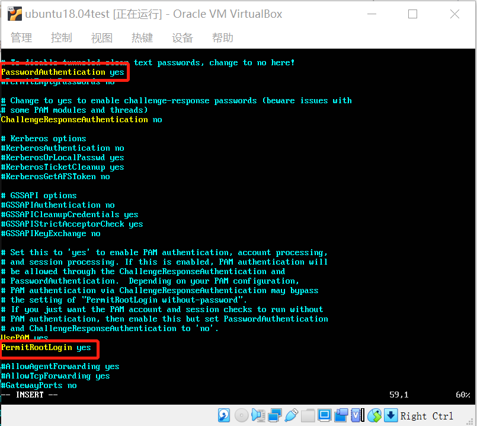

- 在目标主机上重启ssh服务

  sudo systemctl restart ssh

- 在工作主机上生成公私钥

  创建.ssh文件夹

  cd ~

  ssh localhost

  之后进入.ssh文件夹路径

  cd ~/.ssh

  生成一对公私钥

  ssh-keygen -f foo 

  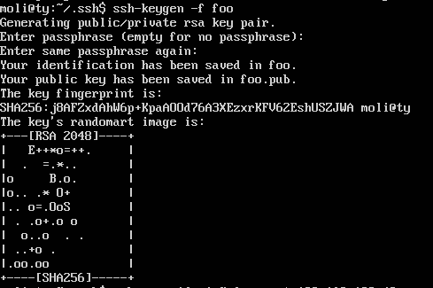

- 在工作主机上通过ssh-copy-id方式导入ssh-key 

  ssh-copy-id -i ~/.ssh/foo.pub root@192.168.138.42

- 在目标主机上设置免密登录

  修改目标主机配置文件

  sudo vim /etc/ssh/sshd_config

  PasswordAuthentication no

  PermitRootLogin without-password

   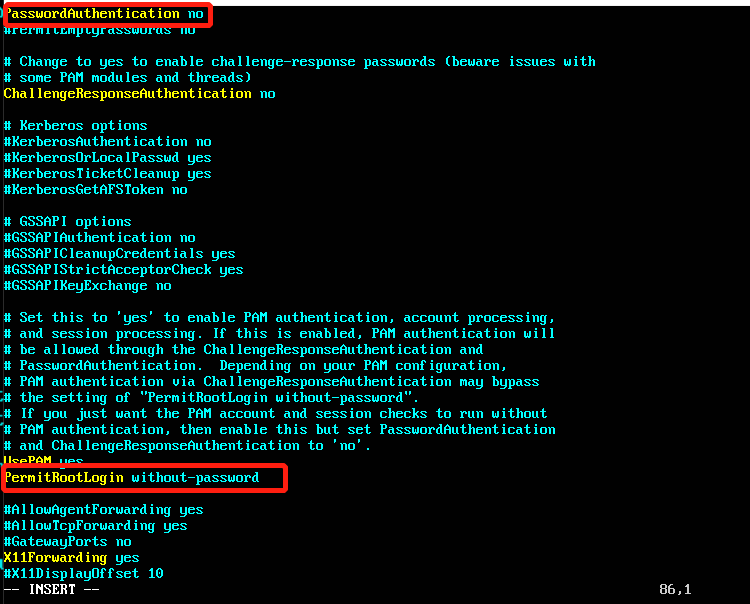

  重启ssh服务

  sudo systemctl restart ssh

## FTP

- 远程登录

  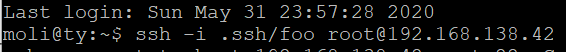

  -- 将脚本文件vsftpd.sh拷贝到目标主机

  scp -i .ssh/foo /home/moli/scripts/ftp/vsftpd.sh root@192.168.138.142:/tmp/workspace/ftp

  -- 远程命令执行实现目标主机控制安装和配置

  -- ssh -i .ssh/foo root@192.168.138.42 'bash /tmp/workspace/ftp/vsftpd.sh'

- 配置一个提供匿名访问的FTP服务器，匿名访问者可以访问1个目录且仅拥有该目录及其所有子目录的只读访问权限；

  在vsftpd.userlist中添加anonymous

  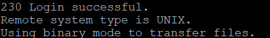

 - 配置一个支持用户名和密码方式访问的账号，该账号继承匿名访问者所有权限，且拥有对另1个独立目录及其子目录完整读写（包括创建目录、修改文件、删除文件等）权限；

   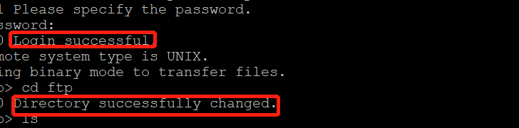

   -- 该账号仅可用于FTP服务访问，不能用于系统shell登录；

      修改/etc/shells

      在shell列表中添加一行/usr/bin/nologin

   -- FTP用户不能越权访问指定目录之外的任意其他目录和文件；

   -- 匿名访问权限仅限白名单IP来源用户访问，禁止白名单IP以外的访问；

      在/etc/hosts.allow中加入物理主机IP(192.168.56.101)

## NFS

  -- 将nfs_s.sh拷贝到目标主机上，让令工作主机运行nfs_s.sh脚本
  
  -- 在工作主机上运行nfs_c.sh脚本

 - 在1台Linux上配置NFS服务，另1台电脑上配置NFS客户端挂载2个权限不同的共享目录，分别对应只读访问和读写访问权限；

   只读访问：/var/nfs/gen_r
   
   读写访问：/var/nfs/gen_rw

 - 实验报告中请记录你在NFS客户端上看到的：

   --共享目录中文件、子目录的属主、权限信息
   
   --你通过NFS客户端在NFS共享目录中新建的目录、创建的文件的属主、权限信息

   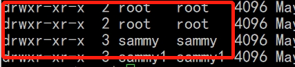

- 上述共享目录中文件、子目录的属主、权限信息和在NFS服务器端上查看到的信息一样吗？无论是否一致，请给出你查到的资料是如何讲解NFS目录中的属主和属主组信息应该如何正确解读

  客户端与服务器端一致的只是 uid 和 gid ，不同主机上的相同 uid 和 gid 并不意味着映射到相同的 用户名 和 组名

## DHCP

- 2台虚拟机使用Internal网络模式连接，其中一台虚拟机上配置DHCP服务，另一台服务器作为DHCP客户端，从该DHCP服务器获取网络地址配置

编辑/etc/netplan/01-netcfg.yaml文件

- client

network:

version: 2

renderer: networkd

ethernets:

    enp0s3:

        dhcp4: yes

    enp0s8:

        dhcp4: yes

    enp0s9:

        dhcp4: yes

- server

network:

version: 2

renderer: networkd

ethernets:

    enp0s3:

        dhcp4: yes

    enp0s8:

        dhcp4: yes

    enp0s9:
        
        dhcp4: no
        
        addresses: [192.168.57.1/24]

- 修改/etc/default/isc-dhcp-server文件

   INTERFACESv4="enp0s9"

   INTERFACESv6="enp0s9"

- 修改/etc/netplan/01-netcfg.yaml

- 检查DHCP
  
  sudo netstat -uap

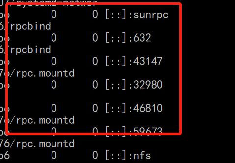

## Samba

-- 在windows 10客户端上连接Linux上的Samba服务器 win+R，输入：\\192.168.56.101\guest

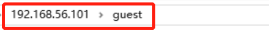

- Linux设置匿名访问共享目录

- Linux设置用户名密码方式的共享目录

  -- 选中demo，点击右键，选择映射网络驱动器,将共享文件夹映射到此电脑目录中

  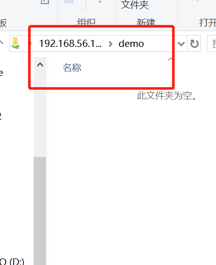

## DNS

- 基于上述Internal网络模式连接的虚拟机实验环境，在DHCP服务器上配置DNS服务，使得另一台作为DNS客户端的主机可以通过该DNS服务器进行DNS查询

- 安装bind

  sudo apt-get install bind9

- 修改配置文件/etc/bind/named.conf.options

  listen-on { 192.168.57.1; };

  allow-transfer { none; };

  forwarders {
 
  8.8.8.8;
 
  8.8.4.4;

  };

- 修改配置文件/etc/bind/named.conf.local

  zone "cuc.edu.cn" {

  type master;

  file "/etc/bind/db.cuc.edu.cn";

  };

- 生成配置文件db.cuc.edu.cn

  sudo cp /etc/bind/db.local /etc/bind/db.cuc.edu.cn

- 编辑配置文件db.cuc.edu.cn

- 安装resolvconf

  sudo apt-get update && sudo apt-get install resolvconf

- 修改配置文件vim /etc/resolvconf/resolv.conf.d/head

  search cuc.edu.cn

  nameserver 192.168.57.1

  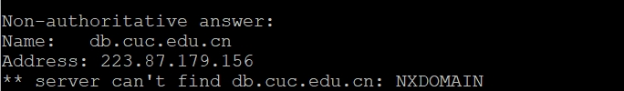

参考资料：

https://blog.csdn.net/TomAndersen/article/details/104227687

https://github.com/CUCCS/linux-2019-luyj/blob/Linux_exp0x06/Linux_exp0x06/Linux_exp0x06.md