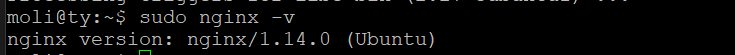

# 第五章作业 Web服务器实验

## 软件环境

Virtualbox

Ubuntu 18.04 Server 64bit

Nginx

VeryNginx

Wordpress

DVWA

## 配置Nginx

- ### 首先查看linux系统

  cat /proc/version

- ### 安装nginx

  sudo apt-get install nginx

- ### 查看nginx是否安装成功

  sudo nginx -v

  如下图所示，即安装成功

  

## 配置VeryNginx

- ### 克隆VeryNginx仓库到本地

  git clone https://github.com/alexazhou/VeryNginx.git 

- ### 安装以下程序

  sudo apt install python 

  sudo apt-get install libpcre3 libpcre3-dev 

  sudo apt-get install libssl-dev libssl-dev 

  sudo apt install gcc 

  sudo apt install make 

  sudo apt-get install zlib1g-dev 

- ### 切换目录

  cd VeryNginx 

- ### 安装verynginx

  sudo python install.py install

  如下图所示，即安装成功

  

- ### 修改配置文件

  user www-data

  server listen 8080

- ### 启动服务

  sudo /opt/verynginx/openresty/nginx/sbin/nginx

  这里出现端口被占用的错误

  netstat -ntulp | grep 8080   查看到nginx进程的pid

  kill -9 pid  杀死进程

  之后再重新启动服务

- ### 访问VeryNginx 界面

  http://verynginx.sec.cuc.edu.cn:8080/verynginx/index.html

   用户名 verynginx

   密码  verynginx
  
  拿上面这个网址访问总是失败，之后用ip地址+端口号访问成功

  之后再从域名开始逐级排查访问

  之后访问 http://192.168.56.101/verynginx/index.html

  

  

 

## 配置Wordpress

- ### 下载安装mysql和php7.2相关程序
  sudo apt install -y mysql-server php7.2-fpm php7.2-mysql php7.2-gd

- ### 进入mysql root 

  sudo mysql -u root -p

- ### 创建WordPress使用的数据库

  CREATE USER 'wordpress'@'localhost' IDENTIFIED BY 'wordpress';

  CREATE DATABASE wp_db;

  GRANT ALL ON wp_db.* TO 'wordpress'@'localhost';

- ### 执行下列操作

  WP_PATH=/var/www/wordpress
  
  sudo mkdir -p ${WP_PATH}/public/

  sudo chown -R www-data:www-data ${WP_PATH}/public
- ### 下载并解压WorePress

  wget https://wordpress.org/wordpress-4.7.zip

  unzip wordpress-4.7.zip

- ### 修改配置文件

  sudo cp -r wordpress/* ${WP_PATH}/public/
  
  cd ${WP_PATH}/public/

  sudo cp wp-config-sample.php wp-config.php

  sudo sed -i s/database_name_here/wp_db/ wp-config.php

  sudo sed -i s/username_here/wordpress/ wp-config.php
 
  sudo sed -i s/password_here/wordpress/ wp-config.php

## 配置DVWA

- ### 下载并解压安装包

  wget https://github.com/ethicalhack3r/DVWA/archive/master.zip

  unzip master.zip

- ### 指定目录并拷贝文件

  DVWA_PATH=/var/www/dvwa

  sudo mkdir -p ${DVWA_PATH}/public/

  sudo chown -R www-data:www-data ${DVWA_PATH}/public

  sudo cp -r DVWA-master/* ${DVWA_PATH}/public/

  cd ${DVWA_PATH}/public/

  sudo cp config/config.inc.php.dist config/config.inc.php

- ### 修改配置文件

  监听端口为8080

- ### 重启nginx令配置生效

  sudo systemctl restart nginx

  

## 安全加固要求实现

- ### 使用IP地址方式均无法访问上述任意站点，并向访客展示自定义的友好错误提示信息页面-1

  添加Matcher

  

  添加response

  

  添加filter

  

  错误提示信息界面
  
  

- ### DVWA只允许白名单上的访客来源IP，其他来源的IP访问均向访客展示自定义的友好错误提示信息页面-2

  添加Matcher、response\filter

  

- ### 在不升级Wordpress版本的情况下，通过定制VeryNginx的访问控制策略规则，热修复WordPress < 4.7.1 - Username Enumeration

  添加Matcher和filter，无需添加response

- ### 通过配置VeryNginx的Filter规则实现对DVWA的SQL注入实验在低安全等级条件下进行防护
  
  添加Matcher、response与filter

## VeryNginx配置要求

- ### VeryNginx的Web管理页面仅允许白名单上的访客来源IP，其他来源的IP访问均向访客展示自定义的友好错误提示信息页面-3

  同上，添加Matcher、response、filter

  白名单访问

  

  非白名单访问

  

- ### 通过定制VeryNginx的访问控制策略规则实现：
      
    -  限制DVWA站点的单IP访问速率为每秒请求数 < 50

    -  限制Wordpress站点的单IP访问速率为每秒请求数 < 20
    
    -  超过访问频率限制的请求直接返回自定义错误提示信息页面-4

       添加response与frequency limit

    -  禁止curl访问
       
       同上添加Matcher、response与filter

# 参考资料

https://blog.csdn.net/qq_23832313/article/details/83578836 （配置nginx） 

https://github.com/alexazhou/VeryNginx 

http://www.linuxdown.net/install/config/2016/0210/4628.html  
（配置VeryNginx）

https://www.cnblogs.com/sanduzxcvbnm/p/11400349.html