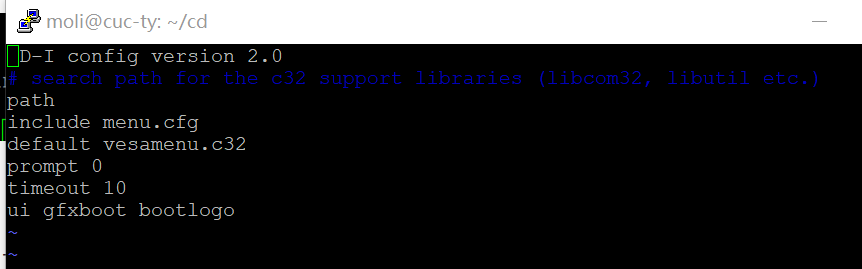

# linux-2020-cuc-ty
linux-2020-cuc-ty created by GitHub Classroom

# 第一次作业

### 软件环境

Virtualbox

Ubuntu 18.04 Server 64bit

### 实验问题

1.如何配置无人值守安装iso并在Virtualbox中完成自动化安装？

2.Virtualbox安装完Ubuntu之后新添加的网卡如何实现系统开机自动启用和自动获取IP？

3.如何使用sftp在虚拟机和宿主机之间传输文件？

### 实现特性

定制一个普通用户名和默认密码

定制安装OpenSSH Server

安装过程禁止自动联网更新软件包

# 有人值守安装Ubuntu系统环境时出现的问题

首次安装完成后再次打开虚拟机时还是安装系统界面，原因是我在第一次安装成功之后，误以为还需要添加ubuntu光驱，所以我手动删除了系统安装镜像盘片

# 无人值守安装

### 设置两块网卡
在设置了两块网卡后，输入 ifconfig -a 之后发现host-only网卡没有启动，之后再输入sudo ifconfig enp0s8 up sudo dhclient enp0s8 来手动启动（在这里我卡了一段时间是因为我把两个语句放在一句输入了。。）

这里获得的IP是192.168.56.101

### 下载putty并连接虚拟机

下载putty如下图所示：

putty连接虚拟机如下图：

### 把镜像文件ubuntu-18.04.4-server-amd64(1).iso 从windows复制进虚拟机

使用下载的的putty里面的psftp.exe

### 挂载镜像文件

#在当前用户目录下创建一个用于挂载iso镜像文件的目录

mkdir loopdir

#挂载iso镜像文件到该目录

mount -o loop ubuntu-16.04.1-server-amd64.iso loopdir

#创建一个工作目录用于克隆光盘内容

mkdir cd
 
#同步光盘内容到目标工作目录

rsync -av loopdir/ cd

#卸载iso镜像

umount loopdir

#进入目标工作目录

cd cd/

#编辑Ubuntu安装引导界面增加一个新菜单项入口

vim isolinux/txt.cfg

### 添加pressed文件

首先要把ubuntu-server-autoinstall.seed通过psftp传到根目录里，在这里遇到的问题是我之前存在电脑文件夹里面的是一个链接文件，所以每次上传是都出现unable to open 错误，之后改成源文件解决问题

之后再把该文件移动到preseed目录下（这里遇到的问题是经常输入错误，preseed跟pressed）

### 修改isolinux.cfg

将timeout 300 改为timeout 10。(可选)

#重新生成md5sum.txt

cd ~/cd && find . -type f -print0 | xargs -0 md5sum > md5sum.txt

#封闭改动后的目录到.iso

IMAGE=custom.iso
BUILD=~/cd/

mkisofs -r -V "Custom Ubuntu Install CD" \
            -cache-inodes \
            -J -l -b isolinux/isolinux.bin \
            -c isolinux/boot.cat -no-emul-boot \
            -boot-load-size 4 -boot-info-table \
            -o $IMAGE $BUILD

在进行最后一个命令时出现错误，然后经查找，先 apt-get update 然后 apt-get install genisoimage

之后把custom.iso移动到home/用户名下，之后再用psftp get custom.iso，这样就得到了需要的无人值守文件

# 无人值守录屏

https://m.weibo.cn/5644290078/4485689720529545

（因为B站审核时间不够了，就发在微博上了）

